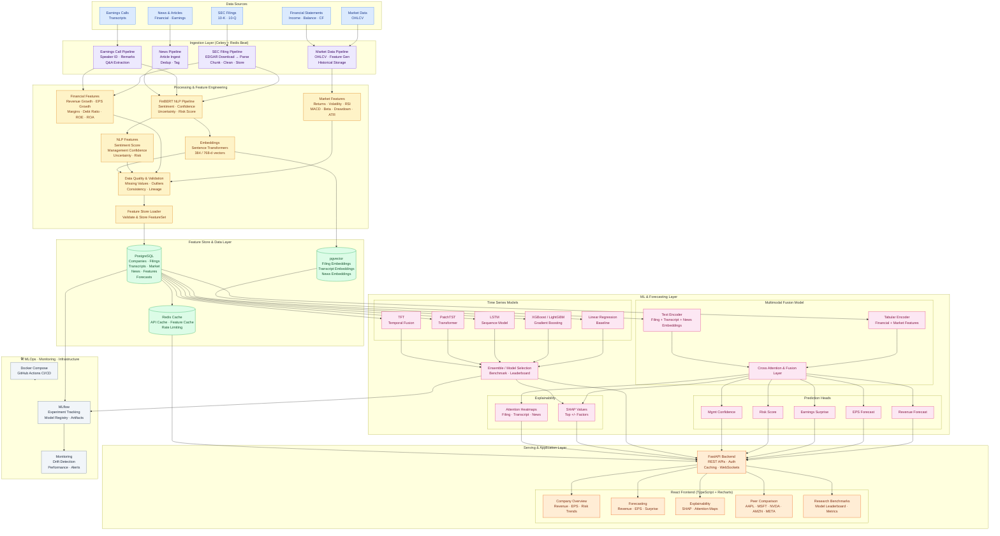

# AnalystGPT ( Multimodal Financial Intelligence And Forecasting Platform )
Multimodal financial intelligence platform for forecasting revenue, EPS, earnings surprises, and risk using SEC filings, earnings calls, news, and market data.

